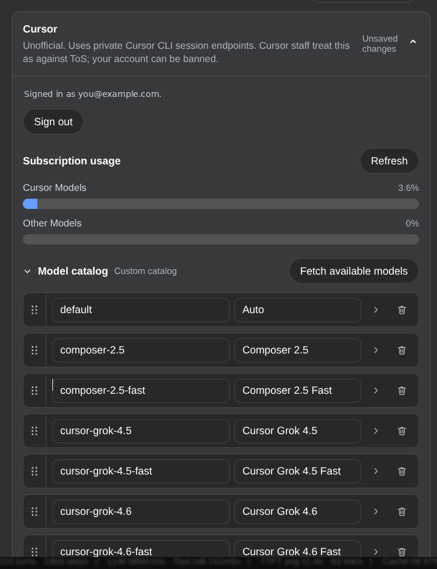
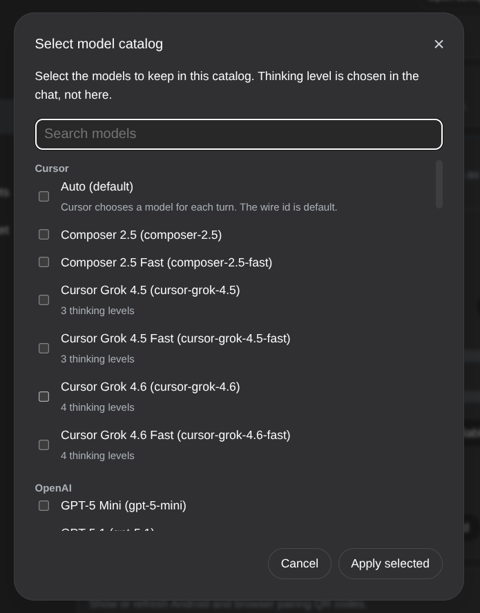
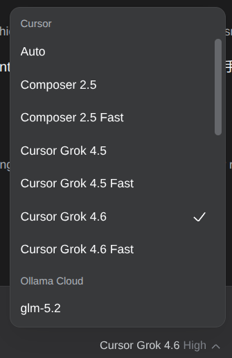

# dsh-llm-cursor

[English](README.md) | 中文

DeepSeek Harness 的**非官方** Cursor 订阅登录与聊天插件。独立提供方路由 `cursor`、设置命名空间 `llm-cursor`。**不**隶属于 Anysphere / Cursor，**不是**官方 Cursor CLI，也不调用官方 Cloud Agents 或 `@cursor/sdk`。

> **封号风险，先读这一段。** Cursor 员工把这类私有客户端用法视为违反服务条款。**Cursor 账号可能被限制或永久封禁。** 安装、登录、发一条对话都算使用。这不是擦边球；只在本机跑也不能保护账号。详见 [风险与服务条款](#风险与服务条款)。

包根导出 Cordis 插件契约。同一产物的 `./client` 在 Settings → LLM Providers 下贡献 Cursor 卡。

## 安装

需要 DeepSeek Harness 0.1.0-rc.6 或更新。从 GitHub 安装。装完再登录，走的就是同一套非官方会话，上面的封号风险立刻适用：

~~~sh
dsh plugin --profile web add github:NOirBRight/dsh-llm-cursor#v0.2.1
dsh web
~~~

仓库跟踪已构建的 lib 产物，GitHub 安装不需要允许构建脚本。源码检出可在 `pnpm run build` 后用 link 安装。

## Web 配置

打开 Settings → LLM Providers → Cursor。卡上的副标题就是上面那句警告：非官方私有接口；Cursor 员工视为违反 ToS；**账号可能被封**。

**用 Cursor 登录**会在 Host 上走 Deep Control PKCE（与官方 CLI 同一会话入口），打开系统浏览器并轮询到完成。会话只存在 Host 的 `$DSH_HOME/cursor-oauth.json`（权限 `0600`）。能读到邮箱则显示。登出删除该文件。浏览器永远收不到 token。

本插件**不**读、不写 `~/.cursor` 或官方 CLI 凭据。卡上没有粘贴码，也没有 Dashboard `crsr_…` API key 登录。

登录后点 **获取可用模型**，用 `GetUsableModels` 拉账号目录。Cursor 把每个思考等级 SKU 都列成独立 id；插件会收成一个模型族，对话里的思考等级再映射回对应 wire id。Fast 仍是独立模型，紧挨在对应标准版后面。你可以勾选要保留的模型族，再排序、改名、改能力旗标并保存。对话选择器使用这份已保存目录。

聊天走 HTTP/2 Connect+protobuf `POST https://api2.cursor.sh/agent.v1.AgentService/Run`。DSH 仍是唯一的 agent loop 与工具执行方。登录后卡上还会展示额度（Cursor Models / Other Models；On-Demand 仅在有用量或上限时显示）。未登录不打额度网；对端没有可用窗口是 unsupported，不是错误。

未登录聊天失败码 `MISSING_CREDENTIAL`。已有会话但 refresh 失败会清会话，失败码 `AUTH`。

## 兼容头

Cursor 会话入口目前要求 CLI 形态的请求头。本包发送：

- `x-cursor-client-type: cli`
- `x-cursor-client-version: cli-2026.01.09-231024f`（源码钉死；变更记 changelog）
- `x-ghost-mode: true`（本进程不执行 Cursor 工作区工具）
- `X-Dsh-Plugin: dsh-llm-cursor/<version>`
- Harness 的 `attributionHeaders()`

这些头是让会话入口接受请求的兼容约束，不是把本插件宣传成官方 Cursor CLI。

需要到 `api2.cursor.sh` 的 HTTP/2（含 ALPN）。V1 不做代理桥；传输失败的文案会点明 HTTP/2。

## 风险与服务条款

**这可能导致 Cursor 账号被封。** 登录成功、对话能发、额度条很低，都不等于被允许。

本插件打的是 **Cursor 私有客户端接口**，和 Oh My Pi 的 `cursor` 提供方同一类非官方用法：Deep Control PKCE 登录，再对 `api2.cursor.sh` 打 HTTP/2 Connect+protobuf 的 `AgentService/Run` 与 `GetUsableModels`，额度走 dashboard 轨道。

Cursor 员工已说明，这类工具违反 [Cursor 服务条款](https://cursor.com/terms-of-service) §1.5（除官方客户端外访问服务 / 对私有客户端 API 做逆向）。见[该论坛帖的员工回复](https://forum.cursor.com/t/does-using-oh-my-pi-s-cursor-provider-or-an-openai-compatible-proxy-to-the-same-endpoints-violate-cursor-s-tos/167778/5)。可能的处置包括限制账号或永久封禁。个人使用、只在本机跑、已付费订阅、「我没有对外卖号」，都不改变这一点。

目前官方支持的面是 Cursor IDE、Cursor CLI、[`@cursor/sdk`](https://cursor.com/docs/sdk) 和 Cloud Agents。那些跑的是 **Cursor 自己的 agent harness**，不是 DeepSeek Harness 能当模型路由驱动的原始推理面。社区要求官方 OpenAI 兼容 chat completions 的[功能请求](https://forum.cursor.com/t/openai-compatible-v1-chat-completions-for-cloud-api/164522)仍开放，没有公布时间表。

以上不是法律意见。安装和使用风险自负。另见 [Acceptable Use Policy](https://cursor.com/acceptable-use-policy)。

## 限制

- 必须能对 `api2.cursor.sh` 走 HTTP/2（含 ALPN）；没有代理桥。
- CLI 版本钉死值会在 Cursor 发新 CLI 后失效；变更时记 changelog。
- 额度百分比来自非官方 dashboard 轨道，不是官方 usage API。
- `Run` 的 token usage 没有 cache 字段，DSH 的 cache hit rate 会空着。
- Fast SKU 是独立模型族（`gpt-5.2` 与 `gpt-5.2-fast`），不是对话选择器里的第三项。

## 配置

~~~yaml
- id: llm-cursor
  name: 'dsh-llm-cursor'
  config:
    streamIdleTimeoutMs: 300000
    retryPolicy:
      mode: normal
      backoff:
        initialDelayMs: 500
        maxDelayMs: 10000
        jitterRatio: 0.1
~~~

没有 `apiKeyEnv`，也没有用户可改的聊天基址或 CLI 版本。在插件卡上保存后，所选目录写入 `models`。

Models 页如果出现 Cursor，也只是 hint。因为本包不声明 `apiKeyEnv`，那一行不应出现「缺 API key」红点。

## 许可

MIT。vendored 的 AgentService protobuf 绑定来自 [oh-my-pi](https://github.com/can1357/oh-my-pi)（MIT），见 `NOTICE`。
